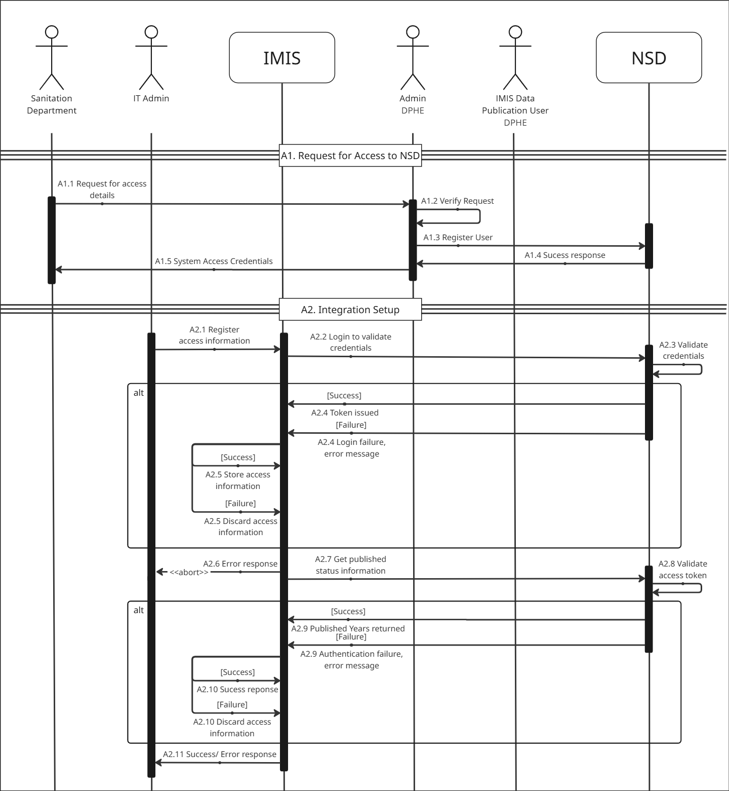
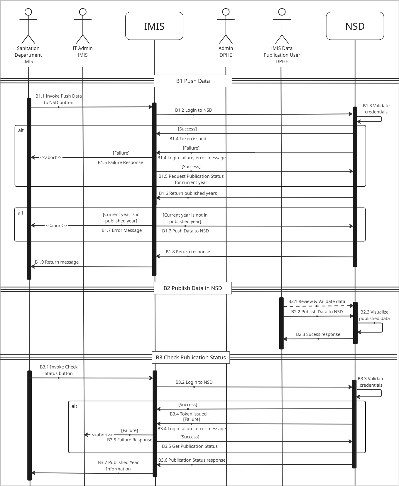

# Release Notes: Base IMIS v1.3.0 - NSD Integration

**Final draft for branch review and release preparation**

| Item | Details |
|---|---|
| **Branch** | `v1.3.0-nsd` |
| **Status** | Draft for review |
| **Audience** | PM, Technical Team, QA, and Implementation Team |
| **Reference commit** | `d3b21b9` |

## 1. Release Summary

This release adds integration between the Base IMIS CWIS Dashboard and the National Sanitation Dashboard (NSD). Authorized users can configure the NSD connection, check indicator publication status, and push selected CWIS indicator data from IMIS to NSD.

The integration is being prepared as an open-source release so it can be reviewed, reused, and adapted by other cities or projects after approval.

## 2. User-Facing Changes

- Added an **NSD Integration Setting** screen under CWIS IMS.
- Added configuration for city, NSD authentication URL, NSD send-data URL, username, and password.
- Added CWIS Dashboard actions to check publication status and push indicator data to NSD.
- Added display of draft and published years returned by NSD.
- Blocked re-publishing of years already marked as published.
- Added clear messages for successful requests and common error conditions.

## 3. Steps To Reproduce

| Area | Change | Repository path / note |
|---|---|---|
| NSD settings UI | Create/edit forms | `resources/views/fsm/nsd-setting/` |
| CWIS dashboard UI | Status and push controls | `resources/views/cwis/cwis-dashboard/chart-layout/cwis-dash-layout.blade.php` |
| Sidebar / menu | NSD Integration Setting menu entry | `resources/views/includes/sidebar.blade.php` |
| NSD dashboard controller | Token, status, data retrieval, and push flow | `app/Http/Controllers/Fsm/NsdDashboardController.php` |
| NSD settings controller | Create/update and validation | `app/Http/Controllers/Fsm/NsdSettingController.php` |
| Model | NSD model | `app/Models/Fsm/Nsd.php` |
| Service | CWIS setting integration support | `app/Services/Fsm/CwisSettingService.php` |
| Routes | NSD dashboard and settings routes | `routes/web.php` |
| Database | NSD settings table | `database/migrations/2025_04_28_123002_nsd_setting.php` |
| Permissions | Permission and role seeder changes | `database/seeders/PermissionsSeeder.php`, `database/seeders/RolePermissions/` |
| Documentation | API note and data dictionary | `documentations/code_documents/19 - NSD Api.md`, `documentations/data_dictionary/data_dictionary.md` |

## 4. Database and Permission Files

- `database/migrations/2025_04_28_123002_nsd_setting.php`
- `database/seeders/PermissionsSeeder.php`
- `database/seeders/RolePermissions/GuestSeeder.php`
- `database/seeders/RolePermissions/MunicipalityExecutiveSeeder.php`
- `database/seeders/RolePermissions/MunicipalityITAdminSeeder.php`
- `database/seeders/RolePermissions/MunicipalitySanitationDepartmentSeeder.php`

## 5. Routes Added

```text
POST /fsm/nsd/authenticate
GET  /fsm/nsd/push-nsd/{year}
GET  /fsm/nsd/cwis-data/{year}
GET  /fsm/nsd/cwis-status
GET  /fsm/nsd-setting
GET  /fsm/nsd-setting/create
POST /fsm/nsd-setting
GET  /fsm/nsd-setting/{id}/edit
PUT  /fsm/nsd-setting/{id}
```

## 6. Configuration Required

NSD configuration is entered through the **NSD Integration Setting** screen and stored in `cwis.nsd_setting`.

The table stores:

```text
nsd_username
nsd_password
city
api_login_url
api_post_url
```

Real credentials, tokens, and production endpoint details must not be committed to GitHub or included in screenshots, logs, or documentation.

## 7. Deployment Commands

Run the migration first, followed by all five seeders in the order shown below.

### Plain PHP / Artisan

```bash
php artisan migrate --path=database/migrations/2025_04_28_123002_nsd_setting.php

php artisan db:seed --class="Database\\Seeders\\PermissionsSeeder"
php artisan db:seed --class="Database\\Seeders\\RolePermissions\\GuestSeeder"
php artisan db:seed --class="Database\\Seeders\\RolePermissions\\MunicipalityExecutiveSeeder"
php artisan db:seed --class="Database\\Seeders\\RolePermissions\\MunicipalityITAdminSeeder"
php artisan db:seed --class="Database\\Seeders\\RolePermissions\\MunicipalitySanitationDepartmentSeeder"
```

### Docker Compose

```bash
docker compose run --rm artisan migrate --path=database/migrations/2025_04_28_123002_nsd_setting.php

docker compose run --rm artisan db:seed --class="Database\\Seeders\\PermissionsSeeder"
docker compose run --rm artisan db:seed --class="Database\\Seeders\\RolePermissions\\GuestSeeder"
docker compose run --rm artisan db:seed --class="Database\\Seeders\\RolePermissions\\MunicipalityExecutiveSeeder"
docker compose run --rm artisan db:seed --class="Database\\Seeders\\RolePermissions\\MunicipalityITAdminSeeder"
docker compose run --rm artisan db:seed --class="Database\\Seeders\\RolePermissions\\MunicipalitySanitationDepartmentSeeder"
```

Clear application caches if required by the deployment environment:

```bash
php artisan optimize:clear
```

## 8. API and Data Flow

The detailed NSD integration workflows described in this section are included in the [**User Manual**](documents/Base_IMIS_User_Manual_V1.1.2.docx). The user manual documents the complete actor interactions, validation steps, success and failure paths, data-publication process, and publication-status checks.

The summary below is retained in these release notes for quick reference:

1. An authorized user configures the NSD connection settings in IMIS.
2. IMIS authenticates with NSD and receives a bearer token.
3. IMIS checks draft and published years for the configured city.
4. The user selects an eligible CWIS indicator year.
5. IMIS maps and sends the selected indicator data to NSD.
6. Published years are blocked from being sent again.
7. The user checks status again to verify the result.

The following sequence diagrams from the user manual are included here as release references.

### Figure 1. NSD Access Request and Integration Setup Workflow



*Figure 1. NSD access request and integration setup workflow, from the NSD Integration User Manual.*

### Figure 2. CWIS Data Push, NSD Publication, and Publication-Status Workflow



*Figure 2. CWIS data push, NSD publication, and publication-status workflow, from the NSD Integration User Manual.*


## 9. Known Dependencies and Notes

- NSD credentials and endpoint URLs must be provided by the NSD or system administration team.
- The configured city must match the value expected by NSD.
- The selected year must contain the required CWIS M&E data.
- Published NSD years are treated as locked.
- If NSD is unavailable, IMIS must show a user-friendly error and must not report a successful push.

## 10. Release References

| Reference | Value |
|---|---|
| Source branch | `v1.3.0-nsd` |
| Reference commit | `d3b21b9` - replace with final reviewed commit |
| Pull request | TBD |
| Release tag | TBD |
| NSD API note | `documentations/code_documents/19 - NSD Api.md` |
| Data dictionary | `documentations/data_dictionary/data_dictionary.md` |
| One-page information sheet | Add repository link after committing the final document |
| User Manual | [Open the Base IMIS User Manual v1.1.2](documents/Base_IMIS_User_Manual_V1.1.2.docx) |


## Git Commit Traceability

**Reference branch:** `v1.3.0-nsd`  
**NSD source comparison:** `upstream/v1.3.0-onesys..v1.3.0-nsd`  
**Current NSD reference head:** `d3b21b9`

The commit IDs below identify the NSD changes brought from the NSD branch into the prepared `v1.3.0-nsd` branch. After the final data dictionary/documentation commit is added, update the final release commit ID or release tag.

| Commit ID | NSD change summary |
|---|---|
| `d3b21b9` | Sidebar fix |
| `2892238` | Message |
| `435252c` | Text changes |
| `b4eb8b1` | Fixed URL issue while checking and pushing data |
| `89df672` | Message and credentials validation changes |
| `4297796` | Added autocomplete off in NSD setting |
| `802b4ae` | NSD model spelling correction |
| `18915e6` | Spelling correction in migration and validation message |
| `48bb69b` | Updated NSD technical documentation and data dictionary |
| `b6dff84` | Dashboard layout, footer, and migration file changes |
| `882547a` | `NsdDashboardController` and permission changes |
| `9198541` | Added NSD Setting |
| `9534ffb` | Added loading animation in push CWIS flow |
| `9023022` | Initial NSD changes |
